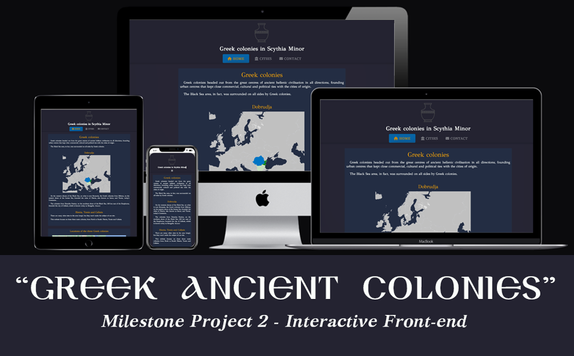

[Back to MAIN README.md](../../README.md)

<p align="center">
    
</p>

---

# **Table of Contents**
- [**Table of Contents**](#table-of-contents)
  - [**Repository location**](#repository-location)
  - [**Fork the repository**](#fork-the-repository)
  - [**Deploy to Neflify Pages**](#deploy-to-neflify-pages)
  - [**Deploy to HitHub Pages**](#deploy-to-hithub-pages)
  - [**Clone locally**](#clone-locally)
  - [**Run project locally**](#run-project-locally)

--- 

## **Repository location**
This repository is located [here](https://github.com/phloreenm/MP2-JS--CI-CoBC-FM) 
## **Fork the repository**
- To fork this repository follow these steps:
    - Login to your GitHub account.
    - Click this [LINK](https://github.com/phloreenm/MP2-JS--CI-CoBC-FM) to visit the repository.
    - Find the Fork button and click it.
    - "Create a new fork" page will show.
    - Name your new forked repository and add a description.
    - Click "Create fork".
    - You should now have forked this repository in your GitHub profile.
- More details about how fork work [here](https://docs.github.com/en/github-ae@latest/get-started/quickstart/fork-a-repo#about-forks), on GitHub's Quickstart Guide.

## **Deploy to Neflify Pages**
- To deploy this project to GitHub Pages follow these steps:
  - Fork this project to your GitHub account.
  - Login to your Neflify account, by using your GitHub account token.
  - After account is created, from the main menu navigate using the top navigation menu to "Sites".
  - Click "Add new site" button and from the dropdown menu select "Import an existing project" then select the before forked project from your GitHub account.
  - Then "Site settings for ``project's name``" page will show. You need to set which branch you want to deploy.
  - Then select "Deploy site" button.
  - After the deploying has finished, you can click the generated link for your site (in the form of ``https://site-name.netlify.app``) to see the deployed project.
  
## **Deploy to HitHub Pages**
- To deploy this project to GitHub Pages follow these steps:
    - Login to your GitHub account.
    - Click this [LINK](https://github.com/phloreenm/MP2-JS--CI-CoBC-FM) to visit the repository.
    - In the top navigation bar, right hand, click the profile icon.
    - From the menu click Settings.
    - In the newly opened page, on the left hand navigation menu, click *Pages* from the *Code, planning, and automation*.
    - Below *Source* select the *None*. A dropdown opens, then select *main* and click *Save* button.
    - The page reloads and a notification at the top of the page is shown.
    - Click the link in the notification to visit the deployed site.
- Read [here](https://docs.github.com/en/github-ae@latest/pages/getting-started-with-github-pages/creating-a-github-pages-site) and [here](https://docs.github.com/en/github-ae@latest/pages/getting-started-with-github-pages/creating-a-github-pages-site#creating-your-site) for more detailed instructions about deploying a repository to GitHub Pages.

## **Clone locally**
- To clone this project locally follow these steps:
    - Login to your GitHub account.
    - Click this [LINK](https://github.com/phloreenm/MP2-JS--CI-CoBC-FM) to visit the repository.
    - At the top of the repository files, select *Code* menu.
    - There are few ways to access this repo:
        - HTTPS using the link provided with Git
        - SSH using a password-protected SSH key.
        - GitHub CLI using the  official CLI from GitHub
        - GitHub Desktop
        - Download a ZIP archive to use it locally in your preferred IDE.
    - We'll continue using **Git Bash**
        - Download [git](https://git-scm.com/download/) and install the right version for your OS.
        - Open Git Bash
        - change the current working directory to a new folder where you'd want to clone the repository.
        - type `git clone` in the CLI and paste the URL you copied from GitHub *Code* menu.
        ```
        $ git clone https://github.com/username/repository
        ```
        - Press *Enter* to clone the repository in the chosen folder.
- Read with more details how to clone a forked repository [here](https://docs.github.com/en/github-ae@latest/get-started/quickstart/fork-a-repo#cloning-your-forked-repository), on GitHub's Quickstart Guide.

## **Run project locally**
- To run this project locally follow the following steps:
    - This project was initially built using the [Code Institute student template for Gitpod](https://github.com/Code-Institute-Org/gitpod-database-config), therefore all the necessary tools are already included in the project.
    - In GitPod workspace of this project, open the terminal and type:
    ```
    python3 -m http.server
    ```
    - Click the  *Make Public* blue button.
    - Then another *Open Browser* blue button should appear.
    - Click it and this should open the default browser with the frontend project running.
    - In the terminal of GitPod it will display the local address and port the project is running like in this example:
    ```
    Serving HTTP on 0.0.0.0 port 8000 (http://0.0.0.0:8000/) ...
    ```


<br>
<p align="right">
    <a href="#table-of-contents">Return to Table of Contents</a>
</p>
<br>

[Back to MAIN README.md](../../README.md)
