[Back to MAIN README.md](../README.md)

<!-- **Testing**
- Jest installing:
    - starting point json - with default values 
    ``` npm init -y ```
    - modify in json file to:
    ``` "test": "jest" ```
    - or to add coverage:
    ``` "test": "jest --coverage" ```
    - installing library (framework) testing into our enviroment:
    ``` npm i --save-dev jest ```
    - install [jest-environment-jsdom](https://www.npmjs.com/package/jest-environment-jsdom):
    ``` npm i jest-environment-jsdom ```
    - create testing file, following the naming rule:
    ``` fileName.test.js ```
    - run test/-s file/-s:
    ``` npm test ``` -->

# **TESTING**
- **CSS Testing**
    - [**Code**](#css-results)
- **HTML Testing**
    - [**index.html**](#home-page)
    - [**cities.html**](#cities-page)
    - [**contact.html**](#contact-page)
    - [**success.html**](#cities-page)
    - [**404.html**](#cities-page)
- **JS Testing**
    - [**Code**](#contact-mobile-view)
- **JS Testing**
    - [**ESLint**](#contact-mobile-view)
- **Accessibility Testing**
    - [**Color testing**](#contact-mobile-view)
    - [**Color testing**](#contact-mobile-view)
    - 
- **Lighthouse Testing**
    - [**Home Page**](#home-page)
    - [**Cities Page**](#cities-page)
    - [**Contact Page**](#contact-page)
    - [**Success Page**](#success-page)
    - [**404 Page**](#404-page)


## **CSS Testing**
### **CSS results**

CSS code has been tested using the  [W3C CSS Validation Service](https://jigsaw.w3.org/css-validator/).
The results show the that the CSS code contains no errors "validates as CSS level 3 + SVG".

<p align="center">
    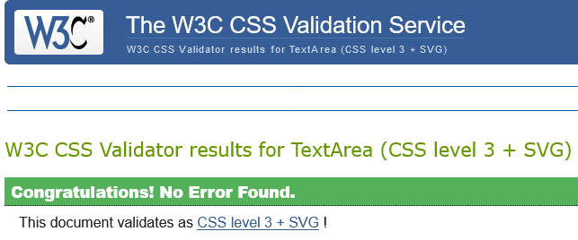
</p>

There are some warnings present, but these are due to the use of the CSS variables and vendor extensions.
<p align="center">
    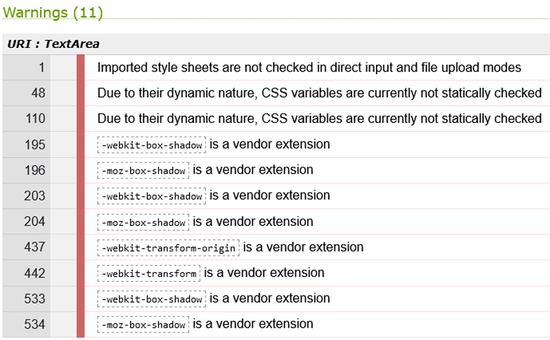
</p>

## **HTML Testing**


---
## **Lighthouse Testing**
### **Home Page**
#### **Desktop view**
<p align="center">
    
</p>

#### **Mobile view**
<p align="center">
    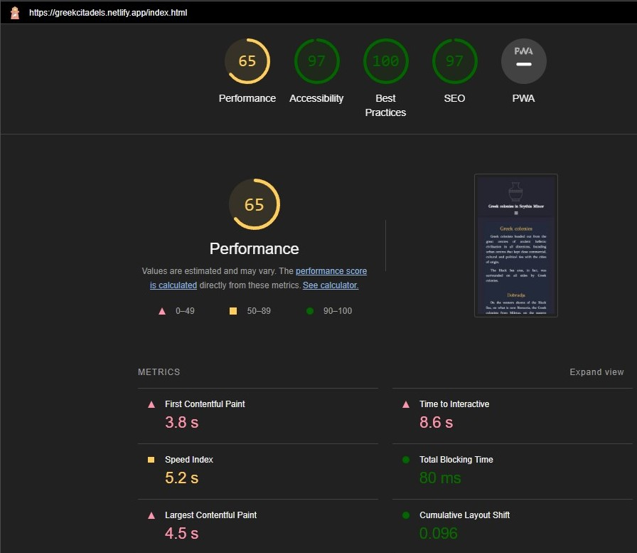
</p>

### **Cities Page**
#### **Desktop view**
<p align="center">
    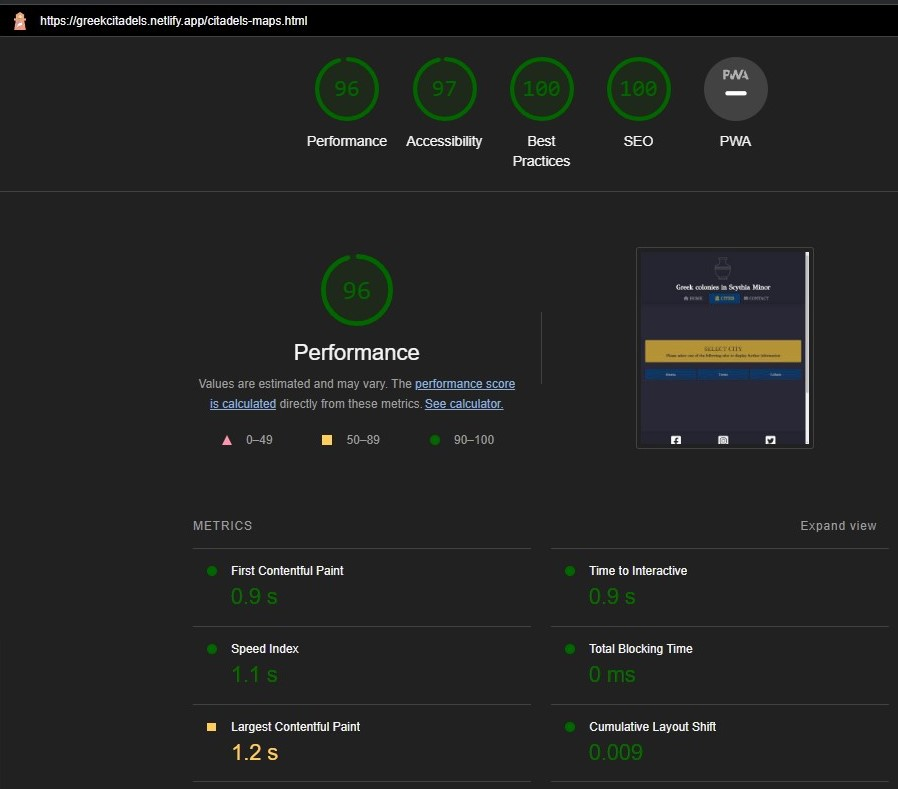
</p>

#### **Mobile view**
<p align="center">
    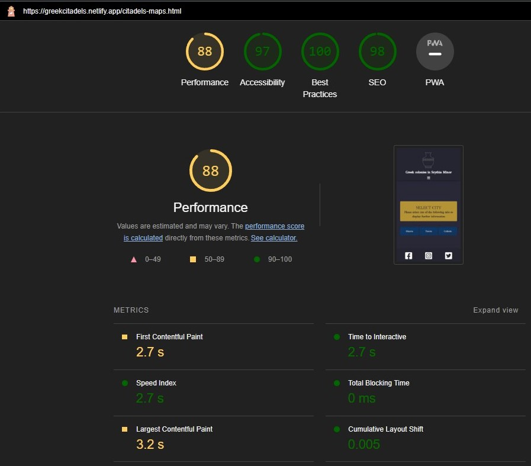
</p>

### **Contact Page**
#### **Desktop view**
<p align="center">
    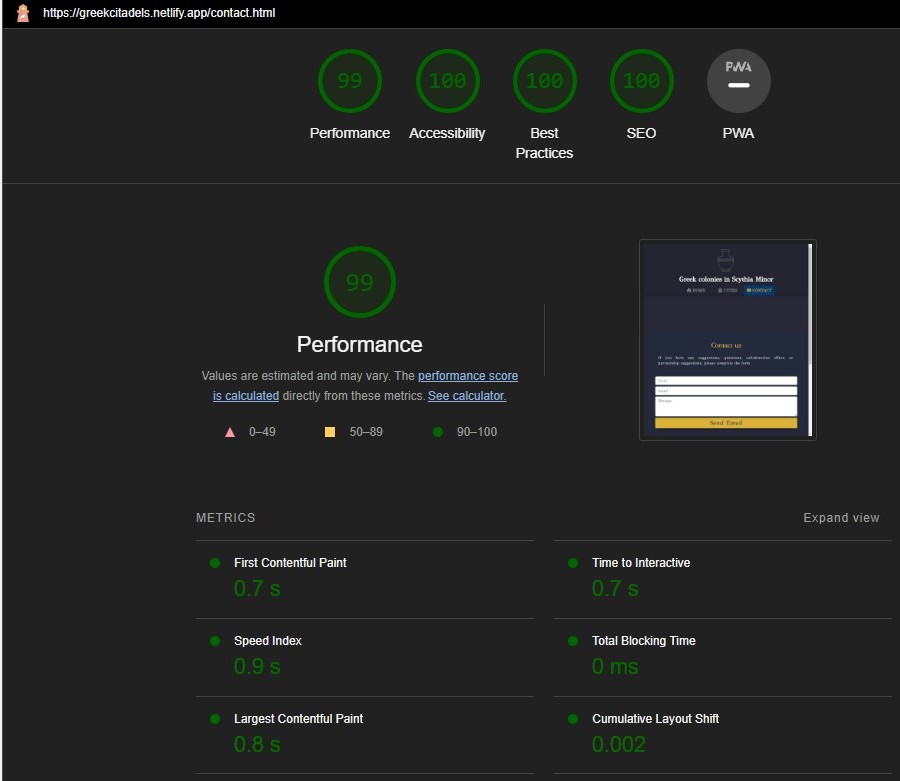
</p>

#### **Mobile view**
<p align="center">
    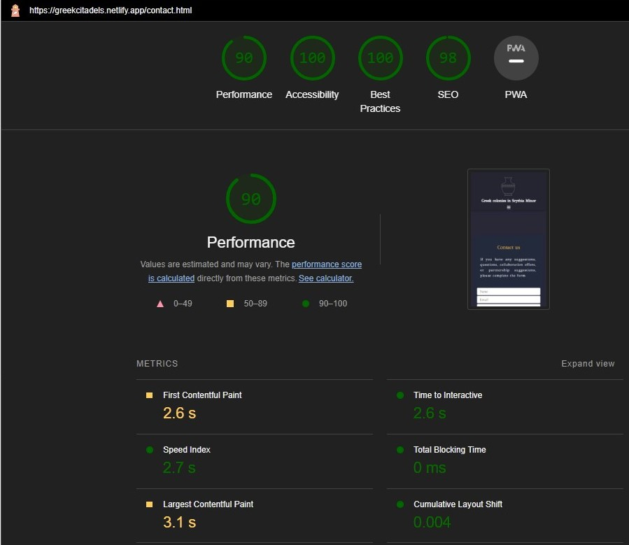
</p>

### **Success Page**
#### **Desktop view**
<p align="center">
    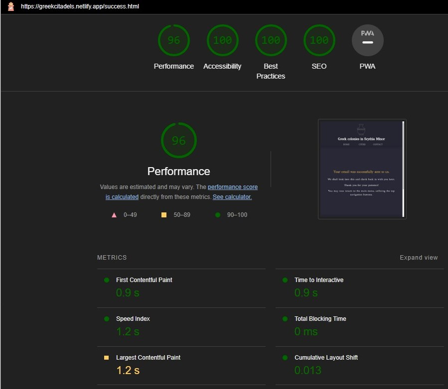
</p>

#### **Mobile view**
<p align="center">
    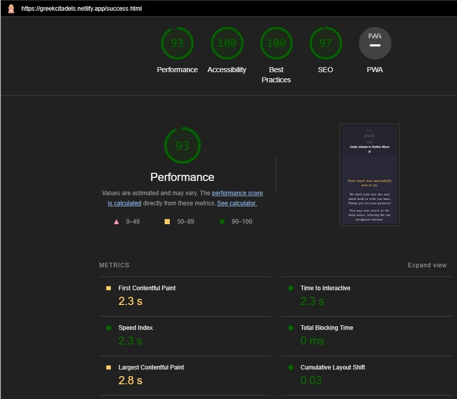
</p>

### **404 Page**
#### **Desktop view**
<p align="center">
    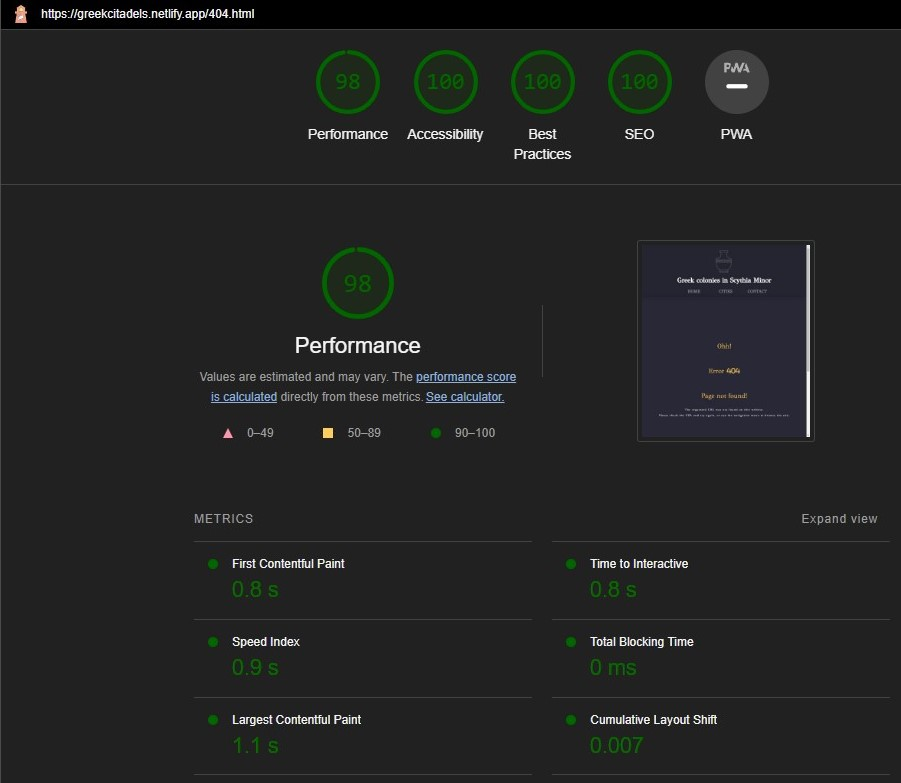
</p>

#### **Mobile view**
<p align="center">
    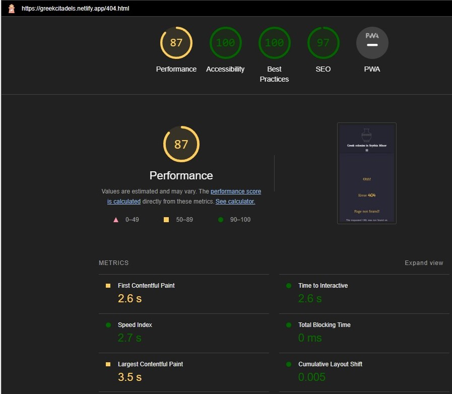
</p>
<br>
    <p align="right">
        <a href="#table-of-contents">Return to Table of Contents</a>
    </p>
    <br>

### **Conclusions**
- The **Performance** score, especially on mobile view, is strongly affected by two main reasons:
  - The exterior dependencies, such as the Google Fonts and the Font Awesome icons, which are not cached by the browser.  
    <p align="center">
        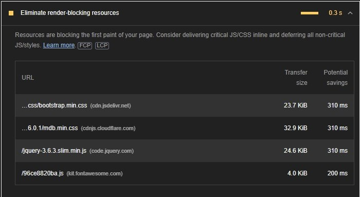
    </p>
    <p align="center">
        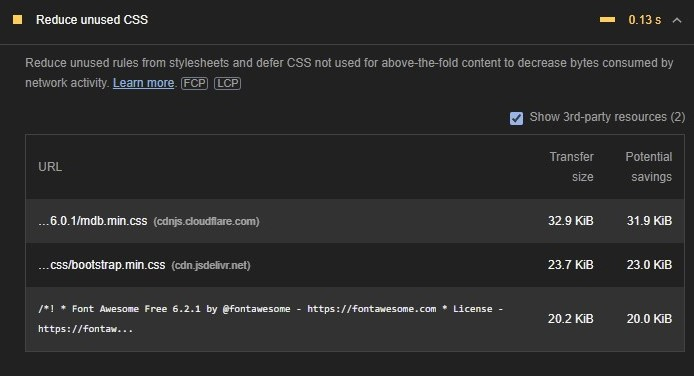
    </p>
  - In mobile view the Lighthouse testing is simulating slower connections that the actual ones, which is affecting the performance score.  
    <p align="center">
        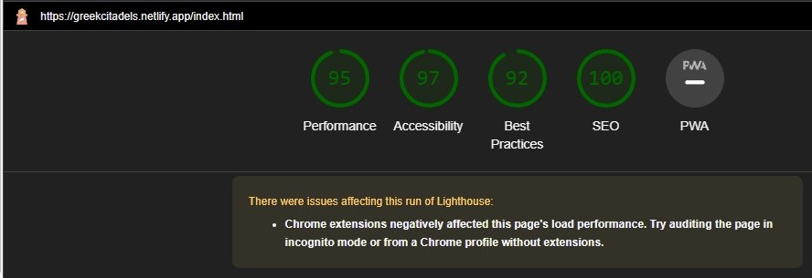
    </p>
    <p align="center">
        
    </p>

    <br>
    <p align="right">
        <a href="#table-of-contents">Return to Table of Contents</a>
    </p>
    <br>
---

## **Accessibility Testing**

### **Color testing**
- [**Color Contrast Checker**](https://webaim.org/resources/contrastchecker/)
  

---

<br>
<p align="right">
    <a href="#testing">Return to Testing.md Table of Contents</a>
</p>
<br>

---

[Back to MAIN README.md](../README.md)