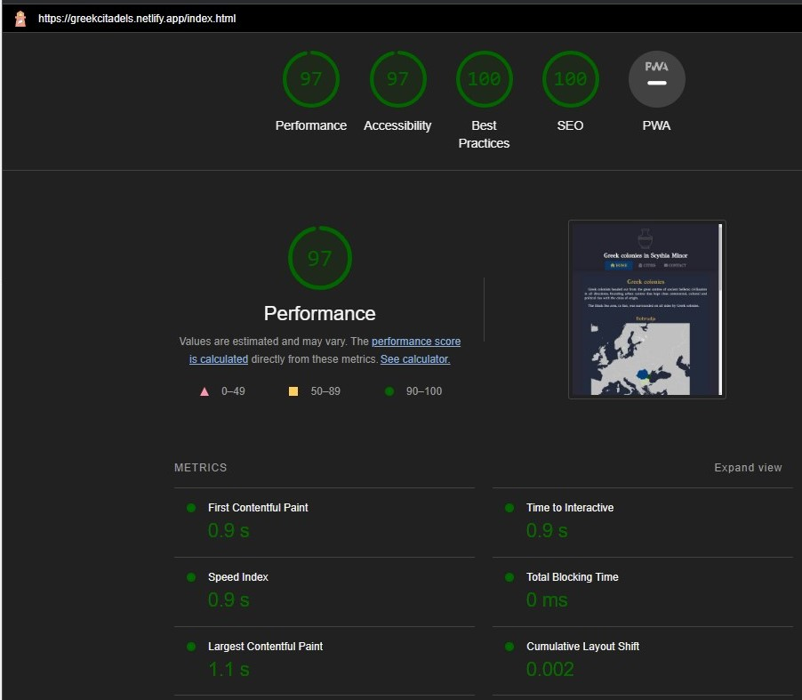
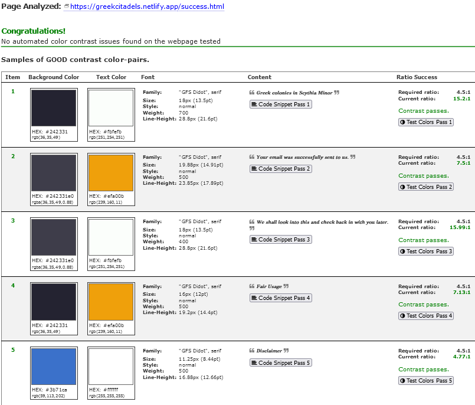

[Back to MAIN README.md](../README.md)

<!-- **Testing**
- Jest installing:
    - starting point json - with default values 
    ``` npm init -y ```
    - modify in json file to:
    ``` "test": "jest" ```
    - or to add coverage:
    ``` "test": "jest --coverage" ```
    - installing library (framework) testing into our enviroment:
    ``` npm i --save-dev jest ```
    - install [jest-environment-jsdom](https://www.npmjs.com/package/jest-environment-jsdom):
    ``` npm i jest-environment-jsdom ```
    - create testing file, following the naming rule:
    ``` fileName.test.js ```
    - run test/-s file/-s:
    ``` npm test ``` -->

# **TESTING**
- During the development stages I encountered numerous errors, coming from different reasons. The syntax errors were the easiest of all to fix. Probably the most difficult errors to fix were the ones caused by the external dependencies and APIs. One example is when the base code for the Google Maps API changed without notice (of which I was aware at least), the map and the markers were not loading anymore and the console errors were not guiding towards the actual problem. Another type of issue I had was the outdated or deprecated code. For example, the jQuery, the Material Design for Bootstrap UI and the Popper libraries were older versions and during the Lighthouse testing I got a lower score because of some security known issues of these. So upgrading these libraries to the latest versions fixed that problem, but caused some other bugs, which were fixed later.
  
- **CSS Testing**
    - [**CSS Code**](#css-results)
- **HTML Testing**
    - [**index.html**](#home-page-results)
    - [**cities.html**](#cities-page-results)
    - [**contact.html**](#contact-page-results)
    - [**success.html**](#success-page-results)
    - [**404.html**](#404-page-results)
- **JS Testing**
    - [**ESLint**](#eslint)
      - [**Copyright script**](#cr)
      - [**EmailJS API script**](#email-js)
      - [**Google Maps API script**](#gmaps-earth)
      - [**Zoom on SVG script**](#svg-zoom)
      - [**Tabs displaying script**](#tabs-display)
      - [**Wikipedia Searching Results Fetching API script**](#wiki-fetch)
- **Web Dev Tools in Chrome**
    - [**Console**](#console)
        - [**index.html**](#home-page-console)
        - [**cities.html**](#cities-page-console)
        - [**contact.html**](#contact-page-console)
        - [**success.html**](#success-page-console)
        - [**404.html**](#404-page-console)
- **Lighthouse Testing**
    - [**Home Page**](#lighthouse-report-home-page)
    - [**Cities Page**](#lighthouse-report-cities-page)
    - [**Contact Page**](#lighthouse-report-contact-page)
    - [**Success Page**](#lighthouse-report-success-page)
    - [**404 Page**](#lighthouse-report-404-page)
- **WebPageTest.org Testing**
    - [**Home Page**](#wpt-testing-home-page)
    - [**Cities Page**](#wpt-testing-cities-page)
    - [**Contact Page**](#wpt-testing-contact-page)
    - [**Success Page**](#wpt-testing-success-page)
    - [**404 Page**](#wpt-testing-404-page)
    - [**WPT Conclusions**](#wpt-testing-conclusions)
- **Accessibility Testing**
    - [**Color Contrast Accessibility Validator**](#color-contrast-accessibility-validator)
      - [**Home Page**](#ccav-home-page)
      - [**Cities Page**](#ccav--cities-page)
      - [**Contact Page**](#ccav--contact-page)
      - [**Success Page**](#ccav-success-page)
      - [**404 Page**](#ccav-404-page)
      - [**WPT Conclusions**](#ccav-conclusions)
   

## **CSS Testing**
### **CSS results**

CSS code has been tested using the [W3C CSS Validation Service](https://jigsaw.w3.org/css-validator/) - Validate by direct input by pasting the style.css CSS content into the text area.
The results show the that the CSS code contains no errors "validates as CSS level 3 + SVG".

<p align="center">
    
</p>

There are some warnings present, but these are due to the use of the CSS variables and vendor extensions.
<p align="center">
    
</p>

---

## **HTML Testing**
- The HTML code validation has been done using the [Nu Html Checker](https://validator.w3.org/nu/).
### **Home Page Results**
<p align="center">
    
</p>

### **Cities Page Results**
<p align="center">
    
</p>

### **Contact Page Results**
<p align="center">
    
</p>

### **Success Page Results**
<p align="center">
    
</p>

### **404 Page Results**
<p align="center">
    
</p>

<br>
<p align="right">
    <a href="#testing">Return to Testing.md Table of Contents</a>
</p>
<br>

---

## **JS Testing**
### **ESLint**
- The JS code has been tested using the [ESLint](https://eslint.org/), installed using npm manager. 
 
### **cr**
- No errors found in the [cr.js](./../scripts/cr.js) script file.
<p align="center">
    
</p>

### **email-js**
- The EmailJS API uses dependencies available through the API and the variables declared by ESLint as errors are not errors.
- The code runs as expected.

<p align="center">
    
</p>

### **gmaps-earth**
- The Google Maps API script tested with ESLint shows errors, but again these are caused by the object brought back as a response from our request to the API. Therefore ESLint couldn't identify the object and the variables.
- I've found that there is actually a [ESLint plugin](https://www.npmjs.com/package/eslint-plugin-googlemaps) for Google Maps API, but I could not implement it to work yet.
- The script runs as expected.
<p align="center">
    
</p>

### **svg-zoom**
- The following errors are caused by the properties of the svg element. Those values are being manipulated (called and updated) through JS from the svg's file code and therefore ESLint cannot identify them as valid properties and reports them as errors.
- The code runs as expected.
<p align="center">
    
</p>

### **tabs-display**
- The three errors reported by ESLint are actually function names and they're being called only when some specific events are triggered. For this reason ESLint cannot identify them as functions used in the script and reports these as errors.
- The functions serve their purpose well when called and the code runs as expected.
<p align="center">
    
</p>

### **wiki-fetch**
- The first error reported by ESLint is related to the functions name. Since this function is called when a specific event is triggered, ESLint cannot identify it as a function used in the script later and reports it as an error.
- The second error is related to the variable `x` which is a parameter in the `fetchWikiResults(x)` function declaration. To avoid any confusion, I've used a different name for the parameter in the function's call. This resulted in the ESLint error.
- The code runs as expected.
<p align="center">
    
</p> 

### **ELint Testing Conclusions**
- The ESLint testing has shown that the code is written in a way that ESLint can't identify some of the variables and functions used in the code. This is due to the fact that the some variables and functions are being called only when specific events are triggered or the objects or variables returned in a response from the API are not recognized by the testing module. For this reason, ESLint cannot identify them as functions and variables used in the code and reports them as errors.
- To confirm those errors are not neither runtime nor syntax errors, I've tested the code in the browser and the code runs as expected. Further more, using the DevTools console, I've checked for any errors and there were none, under ideal conditions, as long there is a good internet connection.

<br>
<p align="right">
    <a href="#testing">Return to Testing.md Table of Contents</a>
</p>
<br>

---

## **Web Dev Tools**
### **Console**
- For the purpose of confirming there were no runtime or other errors in the JS scripts, I've used the Web Dev Tools console in Chrome browser to check for any errors. 
 
#### **Home Page Console**
- The API used in the [index.html](./../index.html) page is the Google Maps API. The console shows no errors. The API script is loaded after all the DOM is rendered, so the map content is loaded after the page is fully loaded. I had to use the `defer` parameter in the script tag. At first, the boilerplate code available at the Google Maps API documentation was used, but it stopped working a while ago. The reason was that they've changed the `async` parameter to `defer` and I didn't notice it. The map was not loading at all. After changing the parameter, the map started loading as expected.
<p align="center">
    
</p>

#### **Cities Page Console**
- The Wikipedia Search Fetching API is working as expected. The console shows no errors. But in the case the internet connection drops and the script can't send a request or receive a response, in the console there will be displayed an `ERR_NAME_NOT_RESOLVED` error and a console message which shows which was the failed searched string (the name of the searched item) and the type of error:
<p align="center">
    
</p>

- Regarding the `ERR_NAME_NOT_RESOLVED` I could have used a [try-catch block](https://stackoverflow.com/questions/45338480/try-catch-for-error-message-in-google-maps-api) to suppress the console error, but I've preferred to leave it as it is, so the user can see the error and know that the internet connection is not working properly and the script can't send a request or receive a response.
  
- The only warnings displayed in the console are related to the Google Maps embedded maps (Google Maps Aerial View and 360) and these are caused by Google's embedded sections. Even so, the maps are loading and working as expected.
<p align="center">
    <strong>Histria Maps Tabs </strong>console warnings:<br>
    
</p>
<p align="center">
    <strong>Tomis Maps Tabs </strong>console warnings:<br>
    
</p>
<p align="center">
    <strong>Callatis Maps Tabs </strong>console warnings:<br>
    
</p>

#### **Contact Page Console**
<p align="center">
    
</p>

#### **Success Page Console**
<p align="center">
    
</p>

#### **404 Page Console**
<p align="center">
    
</p>

<br>
<p align="right">
    <a href="#testing">Return to Testing.md Table of Contents</a>
</p>
<br>

---

## **Lighthouse Testing**
### **Lighthouse Report Home Page**
#### **Desktop view**
<p align="center">
    
</p>

#### **Mobile view**
<p align="center">
    
</p>

### **Lighthouse Report Cities Page**
#### **Desktop view**
<p align="center">
    
</p>

#### **Mobile view**
<p align="center">
    
</p>

### **Lighthouse Report Contact Page**
#### **Desktop view**
<p align="center">
    
</p>

#### **Mobile view**
<p align="center">
    
</p>

### **Lighthouse Report Success Page**
#### **Desktop view**
<p align="center">
    
</p>

#### **Mobile view**
<p align="center">
    
</p>

### **Lighthouse Report 404 Page**
#### **Desktop view**
<p align="center">
    
</p>

#### **Mobile view**
<p align="center">
    
</p>
<br>
    <p align="right">
        <a href="#table-of-contents">Return to Table of Contents</a>
</p>
<br>

---

## **WebPageTest.org Testing**
- For the purpose of more detailed performance testing statistics and as per Lighthouse recommendation, I've used the [WebPageTest.org](https://www.webpagetest.org/) tool. The results are available in the following section.
- These test are conducted on a 4G connection with a 9000/9000 Kbps speed 170ms Latency Connectivity. The location is set to Virginia USA. The tests are made in mobile view on a MOTOG4 (gen4) device and using Chrome browser v108.
### **WPT Testing Home Page**
<p align="center">
    <strong>index.html</strong> Webpage Performance Test Result (Connection View):<br>
    
</p>

- Detailed results of this test can be viewed [here](https://www.webpagetest.org/result/230102_BiDc3H_8RT/3/details/).

### **WPT Testing Cities Page**
<p align="center">
    <strong>index.html</strong> Webpage Performance Test Result (Connection View):<br>
    
</p>

- Detailed results of this test can be viewed [here](https://www.webpagetest.org/result/230102_AiDc9N_96X/2/details/).
  
### **WPT Testing Contact Page**
<p align="center">
    <strong>index.html</strong> Webpage Performance Test Result (Connection View):<br>
    
</p>

- Detailed results of this test can be viewed [here](https://www.webpagetest.org/result/230102_BiDcMQ_8SE/1/details/).

### **WPT Testing Success Page**
<p align="center">
    <strong>index.html</strong> Webpage Performance Test Result (Connection View):<br>
    
</p>

- Detailed results of this test can be viewed [here](https://www.webpagetest.org/result/230102_BiDc3H_8RT/3/details/).

### **WPT Testing 404 Page**
<p align="center">
    <strong>index.html</strong> Webpage Performance Test Result (Connection View):<br>
    
</p>

- Detailed results of this test can be viewed [here](https://www.webpagetest.org/result/230102_BiDcGM_8X8/3/details/).

### **WPT Testing Conclusions**
- As noticed during the Lighthouse testing section and as expected, the result are highly dependent of the network connection speed and stability, on the device used for testing, on the browser used for testing (running in incognito mode shows better results, because of the browser installed plugins), on the location of the testing server (also taking in consideration the localhost) and especially on the external dependencies of the website (e.g. external libraries, APIs, fonts, images and so on).

<br>
<p align="right">
    <a href="#table-of-contents">Return to Table of Contents</a>
</p>
<br>

---

### **Conclusions**
- The **Performance** score, especially on mobile view, is strongly affected these reasons:
  - The exterior dependencies, such as the Google Fonts and the Font Awesome icons, together with the JavaScript libraries (Boostrap, MDBUI, jQuery)  
    <p align="center">
        
    </p>
    <p align="center">
        
    </p>
  - In mobile view the Lighthouse testing is simulating slower connections that the actual ones, which is affecting the performance score.  
    <p align="center">
        
    </p>

    <br>
    <p align="right">
        <a href="#table-of-contents">Return to Table of Contents</a>
    </p>
    <br>

---

## **Accessibility Testing**
### **Color Contrast Accessibility Validator**
- For testing that the minimum contrast ration of 3.5 is met, I've used [**Color Contrast Accessibility Validator**](https://color.a11y.com/Contrast/) online tool.
<p align="center">
    
</p>

#### **CCAV Home Page**
<p align="center">
    <strong>index.html</strong> Color Contrast Accessibility Validator:<br>
    
</p>

#### **CCAV Cities Page**
<p align="center">
    <strong>index.html</strong> Color Contrast Accessibility Validator:<br>
    
</p>

#### **CCAV Contact Page**
<p align="center">
    <strong>index.html</strong> Color Contrast Accessibility Validator:<br>
    
</p>

#### **CCAV Success Page**
<p align="center">
    <strong>index.html</strong> Color Contrast Accessibility Validator:<br>
    
</p>

#### **CCAV 404 Page**
<p align="center">
    <strong>index.html</strong> Color Contrast Accessibility Validator:<br>
    
</p>

#### **CCAV Conclusions**
- The contrast ration across the content of the website is above the required ratio of 4.5:1. The lowest ratio is 4.77:1 at the footer on the Disclaimer button (which opens the modal), but it's still above the required ratio.

---

<br>
<p align="right">
    <a href="#testing">Return to Testing.md Table of Contents</a>
</p>
<br>

---

[Back to MAIN README.md](../README.md)