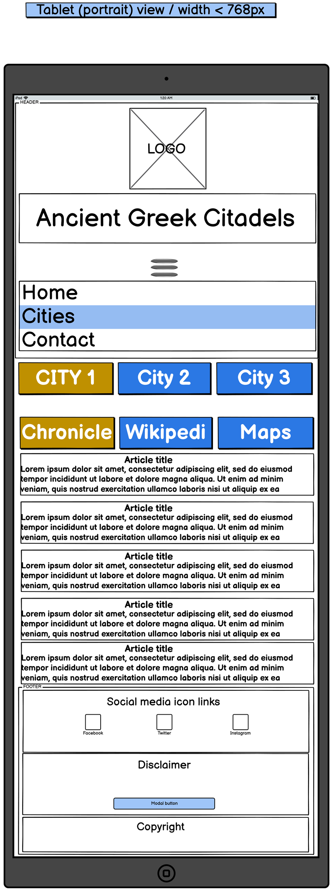

[Back to MAIN README.md](../README.md)

# **WIREFRAMES**
- **Landing Page**
    - [**Mobile view**](#landing-page-mobile-view)
    - [**Tablet view**](#landing-page-tablet-view)
    - [**Desktop view**](#landing-page-desktop-view)
- **Cities Page**
    - [**Mobile view**](#cities-mobile-view)
    - [**Tablet view**](#cities-tablet-view)
    - [**Desktop view**](#cities-desktop-view)
      - [**Chronicle subtab**](#chronicle-view)
      - [**Wikipedia subtab**](#wikipedia-view)
      - [**Maps subtab**](#maps-view)
- **Contact Page**
    - [**Mobile view**](#contact-mobile-view)
    - [**Tablet view**](#contact-tablet-view)
    - [**Desktop view**](#contact-desktop-view) 

---

Site's wireframes were created using Balsamiq app.

---
## **Landing Page Wireframes**
### **Landing Page Mobile View**

    

### **Landing Page Tablet View**

    

### **Landing Page Desktop View**

    

 

    <a href="#wireframes">Return to Wireframes Table of Contents</a>

 

---

## **Cities Page Wireframes**
### **Cities Mobile View**

    

### **Cities Tablet View**

    

### **Cities Desktop View**10
#### **Chronicle View**

    

#### **Wikipedia View**

    

#### **Maps View**

    

 

    <a href="#wireframes">Return to Wireframes Table of Contents</a>

 

---

## **Contact Page Wireframes**
### **Contact Mobile View**

    

### **Contact Tablet View**

    

### **Contact Desktop View**

    

---

 

    <a href="#wireframes">Return to Wireframes.md Table of Contents</a>

 

---

[Back to MAIN README.md](../README.md)